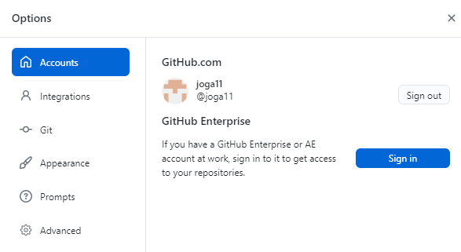

# How to authorize the GitHub account and connect it to the GitHub Desktop Client?

1. In **File** menu select and click **Options**
2. In **Options** window, select **Accounts**.
3. Click **Sign in** on the right of **GitHubcom**.

4. In **Sign in** pane, click **Sign in using your browser**.
5. Type your credentials to your GitHub account and click **Sign in**.
6. If any problems, see [https://docs.github.com/en/desktop](https://docs.github.com/en/desktop)

[Back](./git_github_and_github_desktop.md)