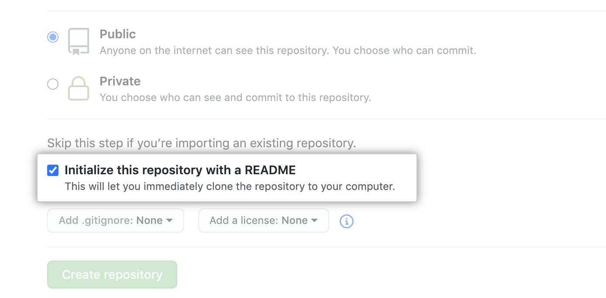

# How to create a new repository?

There are two ways to create a new repository:
* Use GitHub directly, or
* Use GitHub Desktop

# How to create a new repository using GitHub directly?

1. In the upper-right corner of the page, use the drop-down menu marked as **+** and select **New repository**.  

2. Type name for your repository.
3. You can also add a description of your repository.  

4. Choose a repository visibility: **Public**, **Internal**, **Private**.  

5. Click **Initialize this repository with a README**.  

6. Click **Create repository**.  

# How to create a new repository using GitHub Desktop?

1. Click Create a New Repository on your Hard Drive....  

2. Fill in the fields and select your preferred options.  

3. Click Create repository.

[Back](./git_github_and_github_desktop.md)