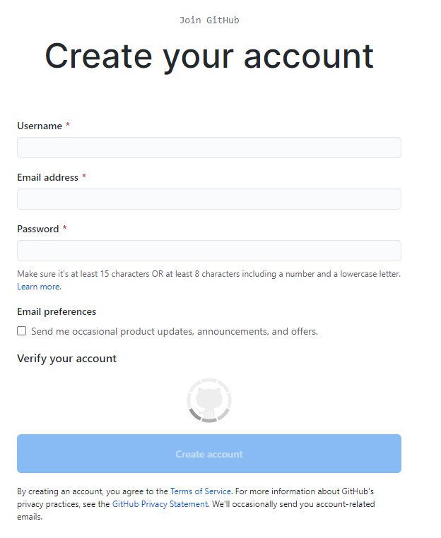

# How to create GitHub account?

1. Go to [https://github.com/join](https://github.com/join) in a web browser. In the upper right corner click on Sign up.

2. Then enter a user name, your email address, and a password.

3. Choose **Create account**, and then follow the instructions.

[Back](./git_github_and_github_desktop.md)